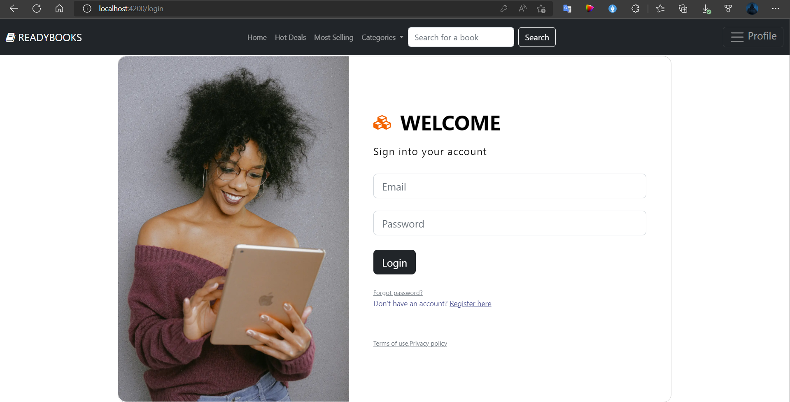
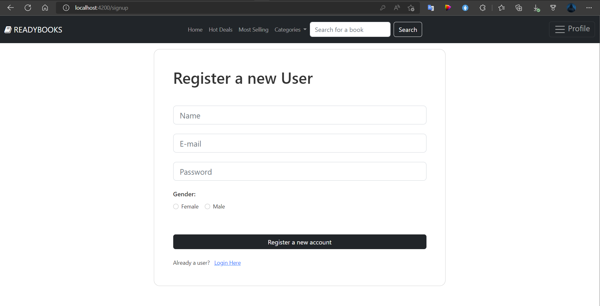
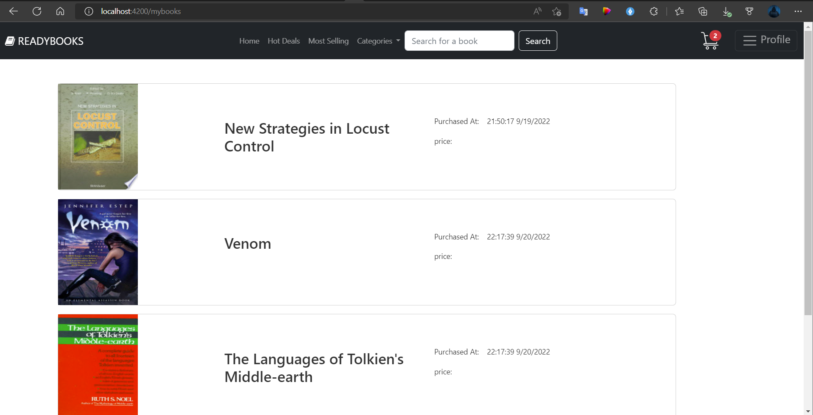
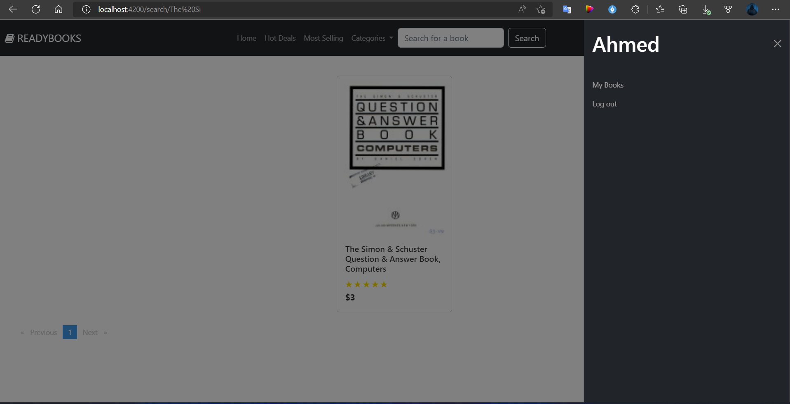
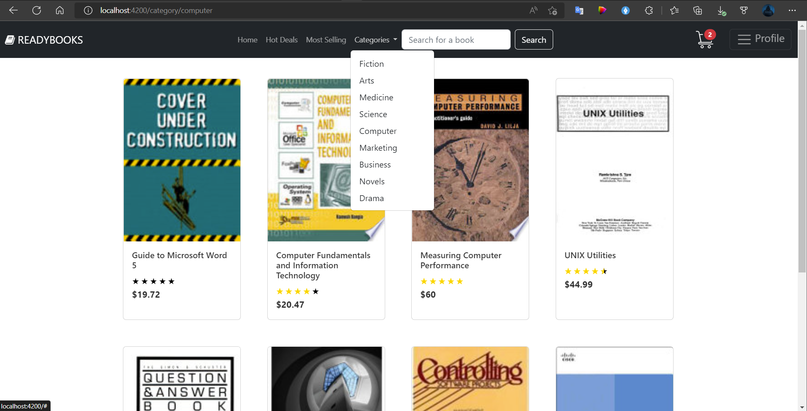
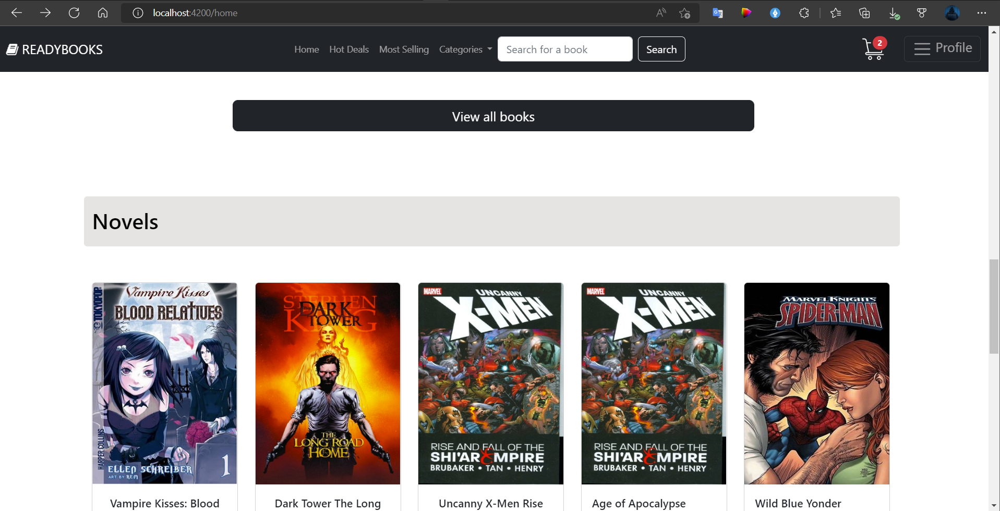
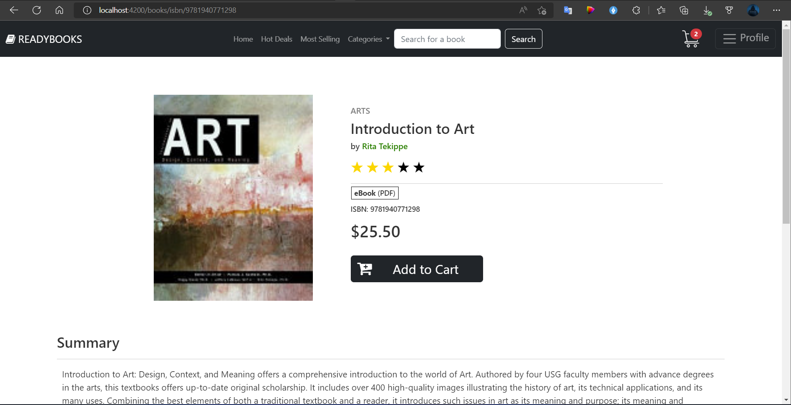
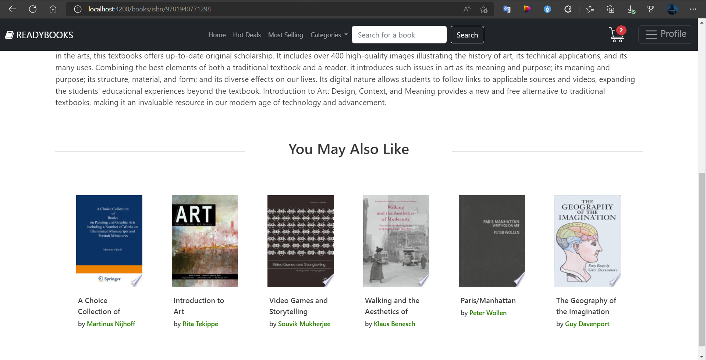
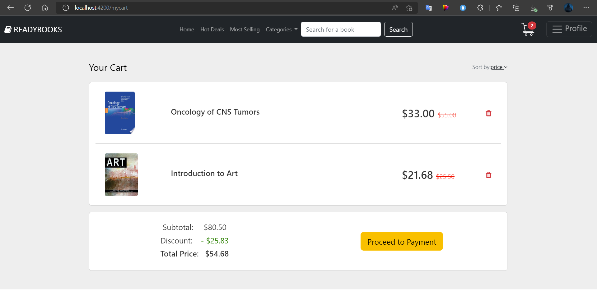
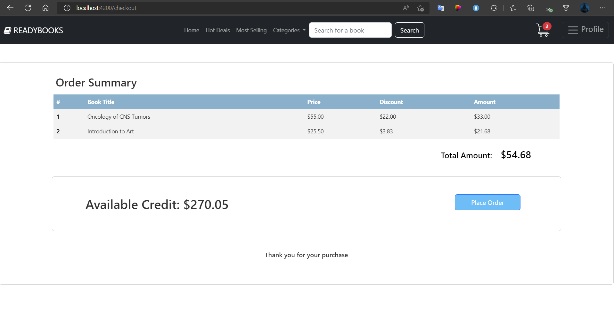

# Online Book Store

A demo for Online Marketplace for selling digital books (e-Books) that can be helpful for increasing the culture and knowledge of people. 

## Features

- The user can search for books by title or category. 
- The user also can get the most selling books and discounts.
- The user can browse the books freely without logging in but cannot add or rate a book until he logs in. 
- The user can register by filling in his name, email, and password and selecting a gender then he can log in, in case of successful registration, and can add books to his cart and make a purchase.
- The user can view his purchased books with some details like the date of purchase.

## Tech Stack

**Client:** Angular, Bootstrap

**Server:** NodeJS, Express

**Database:** MongoDB

## Screenshots

## Authors

- [Ahmed Sobhy](https://github.com/AhmdSobhy)
- [Mohamed Ghoz](https://github.com/MedoGhoz)
- [Mohamed Ahmed ](https://github.com/ZeusDes)
- [Ahmed Elaawam](https://github.com/ArEl3wam)
- [Ahmed Fakhreldin](https://github.com/ahmedfakhr1)
- [Sama Medhat](https://github.com/SamaMedhat1)
- [Alaa Tarek](https://github.com/alaa200112)

